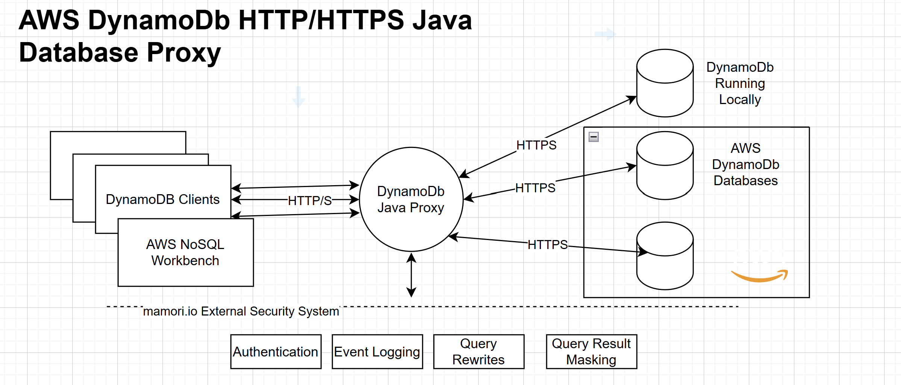

# Mamori.io DynamoDb database proxy

Project Brief/Requirements:

Build a secure, responsive J2SE DynamoDb/HTTP proxy that proxies communication between
DynamoDb clients, DynamoDb databases (local or installed on AWS) and the mmamori.io external security system. The proxy should utilise and communicate using the DynamoDb on-the-wire
client-server network protocol (HTTP/S). You may use the AWS DynamoDb SDK and Netty libraries for handling network communication.

Targets:
* AWS DynamoDb Overview: https://docs.aws.amazon.com/amazondynamodb/latest/developerguide/Introduction.html

The purpose of the proxy is to support:

1. mamori.io authentication
2. mamori.io notification of session and statement events. e.g connections and queries
3. mamori.io notification of session and query errors
4. mamori.io rewriting of queries
5. mamori.io masking of query results

## Interaction Diagram



mamori.io external system interfaces and helper classes are available at  https://github.com/mamori-io/base-db-proxy
(access will be provided on request)

To incorporate the mamori.io db proxy into your project use:
```xml
<dependency>
    <groupId>io.mamori</groupId>
    <artifactId>proxy-base</artifactId>
    <version>1.0-SNAPSHOT</version>
</dependency>
```

To incorporate the Amazon DynamoDb SDK dependency in your project:

```xml
<dependency>
        <groupId>software.amazon.awssdk</groupId>
        <artifactId>dynamodb</artifactId>
        <version>2.33.0</version> 
</dependency>
```
Note, use the latest SDK version:

## DynamoDb Resources
* What is DynamoDb https://docs.aws.amazon.com/amazondynamodb/latest/developerguide/Introduction.html
* DynamoDb Samples  https://github.com/aws-samples/aws-dynamodb-examples
* API Reference  https://docs.aws.amazon.com/amazondynamodb/latest/APIReference/Welcome.html
* SDK : https://docs.aws.amazon.com/amazondynamodb/latest/developerguide/Programming.SDKOverview.html and https://github.com/aws/aws-sdk-java/tree/master/aws-java-sdk-dynamodb
* DynamoDB downloadable DB for local testing https://docs.aws.amazon.com/amazondynamodb/latest/developerguide/DynamoDBLocalHistory.html
* NoSQL Workbench for DynamoDB client https://docs.aws.amazon.com/amazondynamodb/latest/developerguide/workbench.settingup.html

# Definition of done
* Demonstrate running with a local Dynamo Db.
* Demonstrate running with a DynamoDb deployed on AWS.
* Demonstrate running with the NOSQL Workbench for Amazon DynamoDb against a local and AWS DynamoDb with the proxy in the middle.
* Demonstrate running with a local DynamoDb database via the proxy, with the following sample data-sets from https://github.com/aws-samples/amazon-dynamodb-design-patterns/tree/master/example:
  * an-online-shop
  * device-state-log
  * version-control
* Optional. Demonstrate running with the AWS SDK smoke tests: https://github.com/aws/aws-sdk-java/blob/master/aws-java-sdk-dynamodb/src/test/java/com/amazonaws/services/dynamodbv2/smoketests/RunCucumberTest.java
* Meet throughput and scaling targets
* Utilise the mamori.io base proxy interfaces for connection and statement/query logging, query rewrites and result masking
* Produce an OWASP report
* Produce a spot bugs report. Run using: mvn spotbugs:check

Your project should include the following deliverables:

* All source (in /src) with appropriate javadoc
* Comprehensive JUnit Tests for successful and unsuccessful scenarios (in /test)
* Comprehensive JUnit Tests using DynamoDb sample datasets https://github.com/aws-samples/amazon-dynamodb-design-patterns/tree/master/examples with the NoSQL Workbench for Amazon DynamoDb.

Note, you are free to use the AWS SDK DynamoDB driver https://docs.aws.amazon.com/amazondynamodb/latest/developerguide/Programming.SDKOverview.html inside the proxy to communicate with DynamoDb instances.
Communication with DynamoDB clients can use either NETTY and/or Amazon SDK libraries provided the licence permits use.

## Reference Redis Project
A reference Redis database proxy project is available as a guide to implementation and how to incorporate the mamori.io external interfaces and
classes into your proxy code https://github.com/mamori-io/redis-db-proxy
(access will be provided on request)

## Throughput/Scaling Targets
* Support 500 Concurrently Connected Clients/Sessions.
* Add no more than a 5% overhead on network/HTTP operations.
* Scale linearly

## What's provided in this project
* Sample maven file pom.xml
* Base packages (empty)
* OWASP configuration
* SpotBugs configuration

### External System interfaces

The mamori.io Proxy base interfaces, classes and unit test helpers are available at https://github.com/mamori-io/base-db-proxy

* **TargetSystemConnectionDetailProvider**. Main interface for connecting, authenticating and  logging.
* **Session**. Implement this interface for DynamoDb sessions.
* **SessionEvent**. Session events. Use the Session.event callback to notify of session events.
* **Query interface**. Implement this interface for DynamoDb queries. Invoke the rewrite and mask functions for rewriting and masking queries.
* **StatementEvent**. Query events. Use the Query.progress callback to notify of Query/Statement Events.

## Technology Stack
* Java 24+
* JUnit 5.X for testing
* maven for builds.
* logback and slf4j for logging
* Netty and AWS SDK for handling client and server HTTP operations.

## Design/Implementation Guidelines
* Use Asynchronous/non-blocking programming and structures e.g CompletableFutures.
* Catch and log all exceptions. No empty catch clauses.
* The base package for all proxy classes is *io.mamori.proxy.dynamo*.
* Use Netty threading model/platform threads.
* Minimise 3rd party dependencies. No inclusion of 3rd party libraries with viral licences e.g GPL, AGPL etc. Note use of the AWS SDK is acceptable and expected.
* Do not use Spring.

See [pom.xml](pom.xml)

# Need more Info?
Contacts: omasri@mamori.io and dparnell@mamori.io

